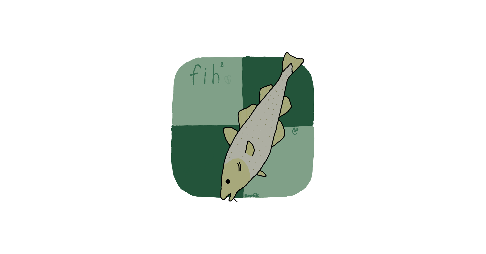

<h1 align="center">fih²</h1>
fih² is a work in progress chess engine to acomplish the goal at getting better and more comfortable with C++. This engine is probably not going to be anywhere near beating top level engines but will hopefully someday be able to beat any human. This is also my third try at this the first one having way to many bugs, so I changed up the code. The second attempt ended up with a working engine but with a lot of copy and pasted code that I didn't write. The third and final attempt will hopefully be the last and I will continue improving on it instead of writing a new one from scratch.
Also dear school district why did you block chess.com?
